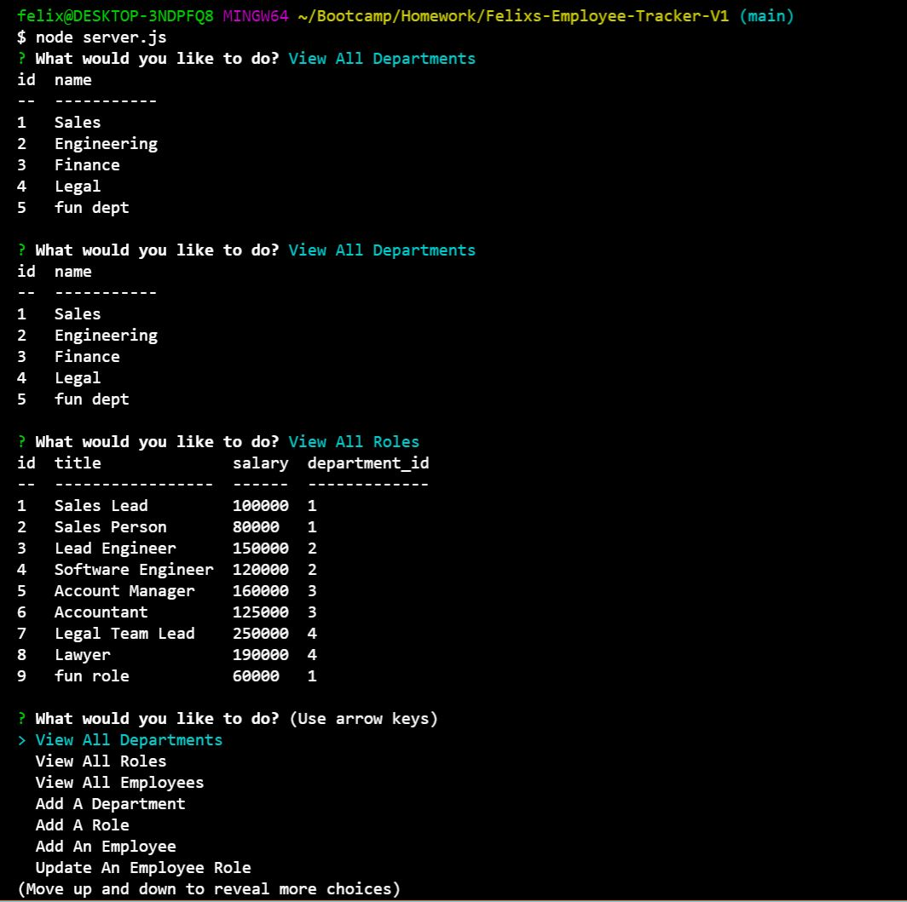
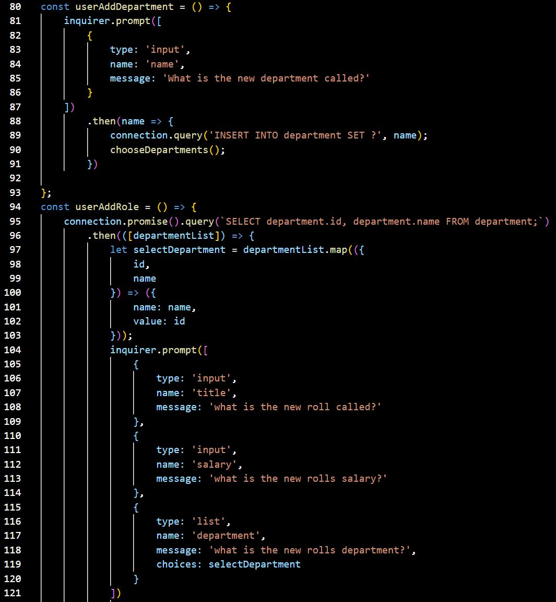

# Felixs-Employee-Tracker-V1

## Description

This tool was designed for non-developers to easily access, view and alter information stored in an employee database. The information is viewed in a list based format with parameters like employees and roles that can be changed through a prompt system. 

## Table of Contents

- [Description](#description)

- [Installation](#installation)

- [Usage](#usage)

- [Contributors](#contributors)

- [Technology](#technology)

- [Links](#links)

## Installation

The application will require an "npm init -y" in order to allow functionality. Once ran, "node server.js" can be executed in the command line to start the prompt menues.

## Usage

This application should be used to easily keep track of and alter an employee database using a terminal interface.

Usage and Code Examples:

## Contributors

[Felix Petzsche GitHub Link](https://github.com/felix1805).

## Technology

This application uses javascript, JEST, HTML, node.js, express, mysql2, node package management and inquirer. 

## Links

[Employee Tracker GitHub Link](https://felix1805.github.io/Felixs-Employee-Tracker-V1/).
[Video Demostration Link](https://youtu.be/zg8mPtgITRQ).
